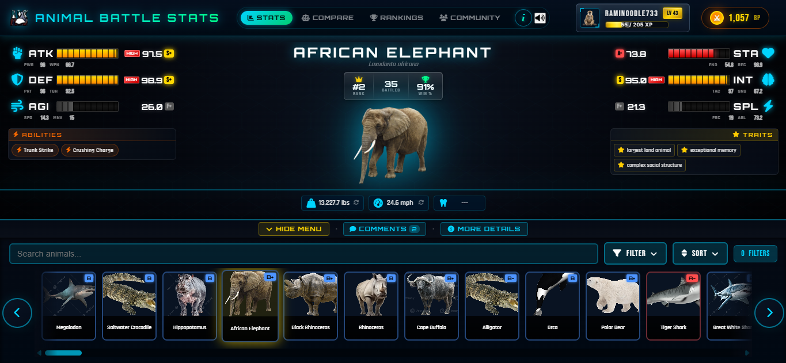
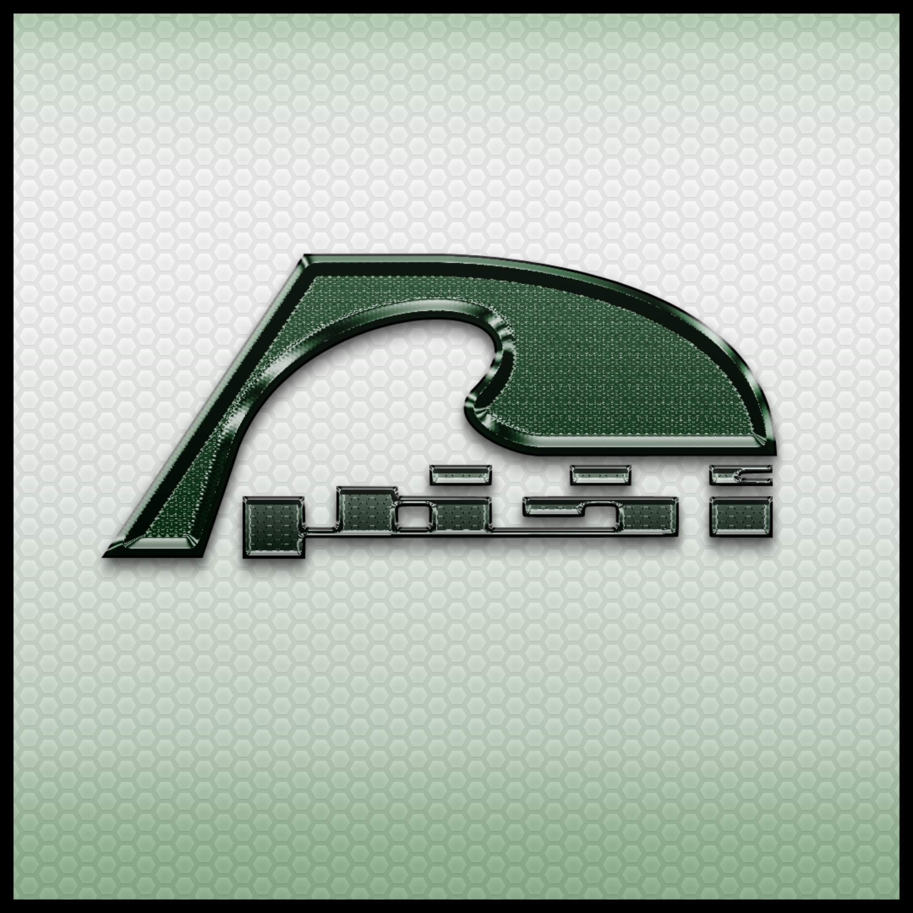

<!-- ═══════════════════════════════════════════════════════════════════════════════ -->
<!-- Profile Theme: Dark Tech-Forward | Primary: #0D1117 | Accent: #00FF41          -->
<!-- ═══════════════════════════════════════════════════════════════════════════════ -->

<!-- ╔═══════════════════════════════════════════════════════════════════════════╗ -->
<!-- ║                              HEADER                                        ║ -->
<!-- ╚═══════════════════════════════════════════════════════════════════════════╝ -->

 

<!-- Name with subtle glow effect -->
<h1>
  
</h1>

**Computer Science Graduate | University of Houston | Cum Laude**

 

<!-- Connect Links -->

&nbsp;

&nbsp;

&nbsp;

&nbsp;

 

<!-- ╔═══════════════════════════════════════════════════════════════════════════╗ -->
<!-- ║                          CURRENT FOCUS                                     ║ -->
<!-- ╚═══════════════════════════════════════════════════════════════════════════╝ -->

<h2 align="center">
   
  CURRENT FOCUS
</h2>

<table>
<tr>
<td width="50%" align="center">

### **Animal Battle Stats**

The ultimate animal powerscaling database.
Compare stats, run tournaments, climb rankings.

**225+ animals** | **ELO rankings** | **Live battles**

</td>
<td width="50%" align="center">

</td>
</tr>
</table>

 

<!-- ╔═══════════════════════════════════════════════════════════════════════════╗ -->
<!-- ║                            PROJECTS                                        ║ -->
<!-- ╚═══════════════════════════════════════════════════════════════════════════╝ -->

<h2 align="center">
  
  PROJECTS
</h2>

<table>
<tr>

<!-- Islamic Glossary Reminders -->
<td width="33%" align="center" valign="top">
 

  
<h3>Islamic Glossary Reminders</h3>

Gamified learning with timed check-ins, streaks, knowledge points, and leaderboards.

 

  
</td>

<!-- Cougar Degree -->
<td width="33%" align="center" valign="top">
 

  
<h3>Cougar Degree</h3>

UH degree planner generating balanced 8-semester roadmaps with prerequisite validation.

 

  
</td>

<!-- Cardio Vision -->
<td width="33%" align="center" valign="top">
 

  
<h3>Cardio Vision</h3>

Boston Scientific capstone — ECG visualization and upload workflow system.

 

  
</td>

</tr>
</table>

 

<!-- ╔═══════════════════════════════════════════════════════════════════════════╗ -->
<!-- ║                           TECH STACK                                       ║ -->
<!-- ╚═══════════════════════════════════════════════════════════════════════════╝ -->

<h2 align="center">
  
  TECH STACK
</h2>

<table>
<tr>
<td align="center" width="50%">

**LANGUAGES**

</td>
<td align="center" width="50%">

**FRAMEWORKS**

</td>
</tr>
<tr>
<td align="center">

**DATABASES**

</td>
<td align="center">

**TOOLS & PLATFORMS**

</td>
</tr>
</table>

 

<!-- ╔═══════════════════════════════════════════════════════════════════════════╗ -->
<!-- ║                            STATISTICS                                      ║ -->
<!-- ╚═══════════════════════════════════════════════════════════════════════════╝ -->

<h2 align="center">
  
  STATISTICS
</h2>

  

  

  

 

<!-- ╔═══════════════════════════════════════════════════════════════════════════╗ -->
<!-- ║                         CONTRIBUTION SNAKE                                 ║ -->
<!-- ╚═══════════════════════════════════════════════════════════════════════════╝ -->

<picture>
  <source media="(prefers-color-scheme: dark)" srcset="https://raw.githubusercontent.com/RamiNoodle733/RamiNoodle733/output/github-snake-dark.svg" />
  <source media="(prefers-color-scheme: light)" srcset="https://raw.githubusercontent.com/RamiNoodle733/RamiNoodle733/output/github-snake.svg" />
  
</picture>

 

<!-- ╔═══════════════════════════════════════════════════════════════════════════╗ -->
<!-- ║                           CREDENTIALS                                      ║ -->
<!-- ╚═══════════════════════════════════════════════════════════════════════════╝ -->

<h2 align="center">
  
  CREDENTIALS
</h2>

🎓 **BS Computer Science, Cum Laude** — University of Houston

📋 **Dean's List** — Spring 2024, Fall 2024, Spring 2025

🤖 **AI Evaluation Specialist** — Outlier AI

 

<!-- ╔═══════════════════════════════════════════════════════════════════════════╗ -->
<!-- ║                          AKHDAR PERFUMES                                   ║ -->
<!-- ╚═══════════════════════════════════════════════════════════════════════════╝ -->

<table>
<tr>
<td align="center">

**Also building:** [Akhdar Perfumes](https://akhdarperfumes.com) — Founder handling product, site & content

</td>
</tr>
</table>

 

 

<!-- ╔═══════════════════════════════════════════════════════════════════════════╗ -->
<!-- ║                              FOOTER                                        ║ -->
<!-- ╚═══════════════════════════════════════════════════════════════════════════╝ -->

