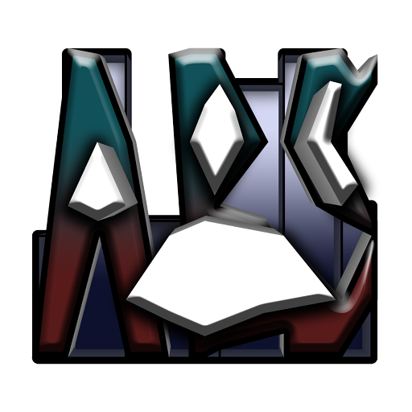
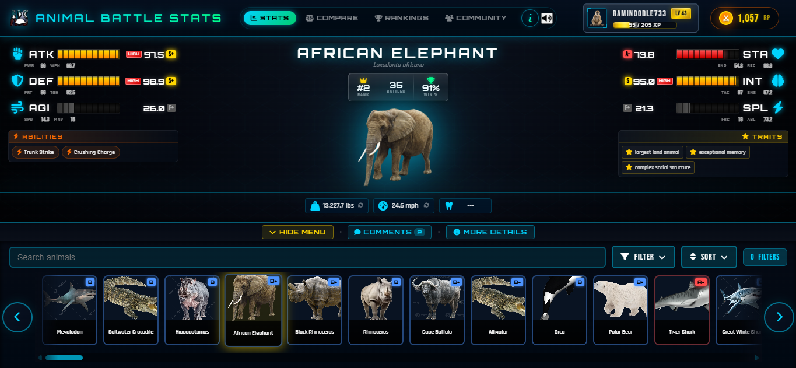
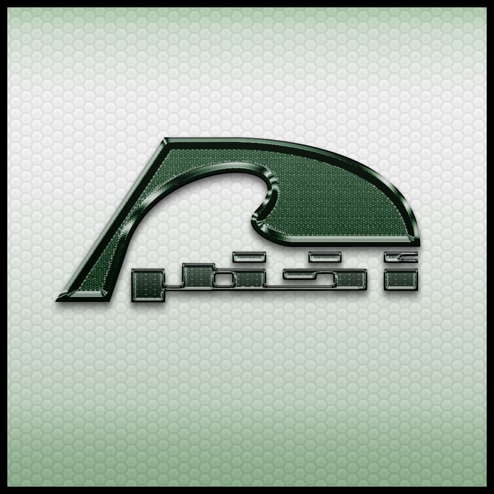

**Computer Science · Cum Laude · University of Houston**

&nbsp;
&nbsp;

 

Full-Stack Development · AI Tools & Workflows · Data Systems & Dashboards

 

---

### Featured

<table>
<tr>
<td width="55%" valign="top">

**[Animal Battle Stats](https://github.com/RamiNoodle733/animal-battle-stats)** · [animalbattlestats.com](https://animalbattlestats.com)

Data platform for comparing 225+ animals across combat stats, ELO rankings, tournaments, and community features. JWT auth, Chart.js visualizations, and serverless APIs.

`JavaScript` `Node.js` `Express` `MongoDB Atlas` `Vercel`

</td>
<td width="45%" align="center" valign="top">

</td>
</tr>
</table>

---

### Projects

<table>
<tr>
<td width="50%" valign="top">
 
 &nbsp;<b><a href="https://github.com/mvmonr0e/cougardegree">Cougar Degree</a></b> · <a href="https://devpost.com/software/cougar-degree">Devpost</a>
 
 AI degree planner generating balanced 8-semester roadmaps with prerequisite enforcement and difficulty-aware scheduling. Dual-LLM pipeline: Gemini 2.5 Flash for parsing, Llama 3 via DigitalOcean Gradient for generation.
 <code>Node.js</code> <code>Express</code> <code>Gemini 2.5 Flash</code> <code>Llama 3</code>
 
</td>
<td width="50%" valign="top">
 
 &nbsp;<b><a href="https://github.com/venkats/sdp25_unknown">Cardio Vision</a></b> · <a href="https://youtu.be/EwiMXSH537k">Demo</a>
 
 ECG analysis web app automating cardiac axis calculations via parallelogram and cosine law methods. Triaxial vector visualizations for clinical interpretation.
 <code>Python</code> <code>Flask</code> <code>SQLAlchemy</code> <code>MySQL</code> <code>Pytest</code>
 
</td>
</tr>
<tr>
<td width="50%" valign="top">
 
 &nbsp;<b><a href="https://github.com/RamiNoodle733/ibm-ai-demo-studio">IBM AI Demo Studio</a></b> · <a href="https://ibm-ai-demo-studio.vercel.app/">Live</a> · <a href="https://youtu.be/0TXq9Tz8eno">Video</a>
 LLM workflow demos — document Q&A with citations, text classification, and CSV summarization. IBM Carbon Design System UI, Prisma ORM, and GPT-4o integration.
 <code>Next.js 16</code> <code>React 19</code> <code>TypeScript</code> <code>Prisma</code> <code>SQLite</code> <code>GPT-4o</code> · Deploy: Vercel
 
</td>
<td width="50%" valign="top">
 
 &nbsp;<b><a href="https://github.com/RamiNoodle733/akhdar-bi-command-center">Akhdar BI Command Center</a></b>
 Power BI executive dashboard tracking net sales, AOV, discounts, and customer segments. Star-schema ETL pipeline with DAX measures for pricing and margin analysis.
 <code>Python</code> <code>pandas</code> <code>SQLAlchemy</code> <code>PostgreSQL 15</code> <code>Docker</code> <code>Power BI</code>
 
</td>
</tr>
<tr>
<td width="50%" valign="top">
 
 &nbsp;<b><a href="https://github.com/RamiNoodle733/Pulseboard">Pulseboard</a></b>
 Anonymous real-time color pulse synchronization platform. Users pulse colors together via WebSockets with gamification — XP, levels, streaks, achievements, upgrades. Glassmorphism UI with GitHub OAuth.
 <code>React</code> <code>TypeScript</code> <code>Vite</code> <code>Fastify</code> <code>Socket.io</code> <code>PostgreSQL</code> <code>Zustand</code>
 
</td>
<td width="50%" valign="top">
 
 &nbsp;<b><a href="https://github.com/RamiNoodle733/gituhb">gitUHb</a></b>
 GitHub project collaboration hub for University of Houston — browse repos, create projects, join teams, upvote, and comment. Integrates GitHub API for READMEs, commits, issues, and contributor stats.
 <code>Next.js 16</code> <code>React 19</code> <code>TypeScript</code> <code>Prisma</code> <code>PostgreSQL</code> <code>NextAuth</code>
 
</td>
</tr>
<tr>
<td width="50%" valign="top">
 
 &nbsp;<b><a href="https://github.com/RamiNoodle733/Akhdar-Perfumes">Akhdar Perfumes</a></b> · <a href="https://akhdarperfumes.com">akhdarperfumes.com</a>
 E-commerce storefront for Arabian attars — product catalog, cart, checkout, and admin panel. Custom Horizon theme with view transitions and JS module imports.
 <code>Shopify Liquid</code> <code>CSS</code> <code>JavaScript</code> · Hosted: Shopify
 
</td>
<td width="50%" valign="top">
 
 &nbsp;<b><a href="https://github.com/RamiNoodle733/ABS-PostBot">ABS-PostBot</a></b>
 Social media automation for Animal Battle Stats — generates and posts spotlights, matchups, power rankings, and fun facts to Reddit (Snoowrap), Discord (webhooks), and X (OAuth 1.0a).
 <code>Node.js</code> <code>Snoowrap</code> <code>Puppeteer</code> <code>node-canvas</code> · CI: GitHub Actions
 
</td>
</tr>
<tr>
<td width="50%" valign="top">
 
 &nbsp;<b><a href="https://github.com/RamiNoodle733/Islamic-Glossary-Reminders">Islamic Glossary Reminders</a></b> · <a href="https://islamic-glossary-reminders.onrender.com">Live</a>
 Gamified Islamic glossary learning — timed check-ins (morning/afternoon/night), streaks, knowledge points with multipliers, achievements, and a community leaderboard.
 <code>Node.js</code> <code>Express</code> <code>MongoDB Atlas</code> <code>JWT</code> <code>bcrypt</code> · Deploy: Render
 
</td>
<td width="50%" valign="top">
 
 &nbsp;<b><a href="https://github.com/RamiNoodle733/Node24">Node24</a></b>
 24-hour planner where "nodes" must sum to exactly 24 hours. Drag-resize via gesture handler and reanimated, haptic feedback, repeating nodes, color themes, and an AI assistant bar.
 <code>React Native</code> <code>Expo SDK 54</code> <code>TypeScript</code> <code>Zustand</code> <code>AsyncStorage</code>
 
</td>
</tr>
<tr>
<td width="50%" valign="top">
 
 &nbsp;<b><a href="https://github.com/RamiNoodle733/job-autopilot">Job-Autopilot</a></b>
 Automated job discovery across LinkedIn, Indeed, and company career pages. Tailors resumes per position via LaTeX, auto-fills ATS forms with Puppeteer, deduplicates postings, and sends Telegram alerts.
 <code>Node.js</code> <code>Puppeteer</code> <code>Cheerio</code> <code>SQLite</code> <code>Commander</code> <code>LaTeX</code>
 
</td>
<td width="50%" valign="top">
 
 &nbsp;<b><a href="https://github.com/RamiNoodle733/Halal-Hot-Chicken-Ranker">Halal-Hot-Chicken-Ranker</a></b> · <a href="https://halal-hot-chicken-ranker.vercel.app">Live</a>
 Community ranking app for halal hot chicken restaurants. Upvote/downvote voting, comments, restaurant submissions via Nodemailer, search and sort. Helmet + compression middleware.
 <code>Node.js</code> <code>Express</code> <code>MongoDB Atlas</code> <code>Vanilla JS</code> · Deploy: Vercel
 
</td>
</tr>
<tr>
<td width="50%" valign="top">
 
 &nbsp;<b><a href="https://github.com/RamiNoodle733/Perfume-Pal">Perfume-Pal</a></b>
 
 AI perfume designer using Google ADK multi-agent architecture — scent planner and formula architect agents translate preferences into custom fragrance formulas.
 <code>Python</code> <code>FastAPI</code> <code>Google ADK</code> <code>Gemini 1.5 Flash</code> · Deploy: Cloud Run (Docker)
 
</td>
<td width="50%" valign="top">
 
 &nbsp;<b><a href="https://github.com/RamiNoodle733/stock-prediction-model">Stock Prediction Model</a></b>
 ML pipeline predicting AAPL/MSFT/AMD stock prices using 52 engineered features and 20-day sliding windows. Compares linear regression, LSTM, and ARIMA models. ACM-formatted LaTeX report.
 <code>Python</code> <code>PyTorch</code> <code>scikit-learn</code> <code>pandas</code> <code>yfinance</code> <code>statsmodels</code>
 
</td>
</tr>
</table>

---

### Open Source Contributions

**pandas** · [v3.0.2 release](https://github.com/pandas-dev/pandas/releases/tag/v3.0.2) — Fixed inconsistent `str` array construction. `pd.array` and `pd.Series` now both preserve NA values consistently. Listed as contributor in release notes.

**OpenClaw** · [PR #18131](https://github.com/openclaw/openclaw/pull/18131) — Fixed gateway self-update crash loop: restart only on successful updates, early exit on failed install/build steps, and auto-runs `openclaw doctor --fix` during updates to sanitize config. Credited in the [v2026.2.17 changelog](https://github.com/openclaw/openclaw/releases/tag/v2026.2.17).

**OpenClaw** · [PR #12973](https://github.com/openclaw/openclaw/pull/12973) — Improved context-overflow recovery UX by suggesting `/reset` when the model hits token limits.

Also explored: [sqlparse](https://github.com/RamiNoodle733/sqlparse) · [datasette](https://github.com/RamiNoodle733/datasette) · [sqlite-utils](https://github.com/RamiNoodle733/sqlite-utils) · [sqlfluff](https://github.com/RamiNoodle733/sqlfluff) · [altair](https://github.com/RamiNoodle733/altair)

---

### Tech Stack

---

### Statistics

  

  

---

### Background

**BS Computer Science, Cum Laude** — University of Houston (May 2025)

Dean's List — Spring 2024, Fall 2024, Spring 2025

**AI Evaluation Specialist** — Outlier AI (Nov 2024 – Present)
 Evaluate and improve AI-generated code for correctness and clarity across Python and JavaScript tasks.

**Coding Instructor** — Coder Kids (Aug 2024 – Jan 2025)
 Taught Scratch and Python fundamentals to students across multiple age groups.

 

