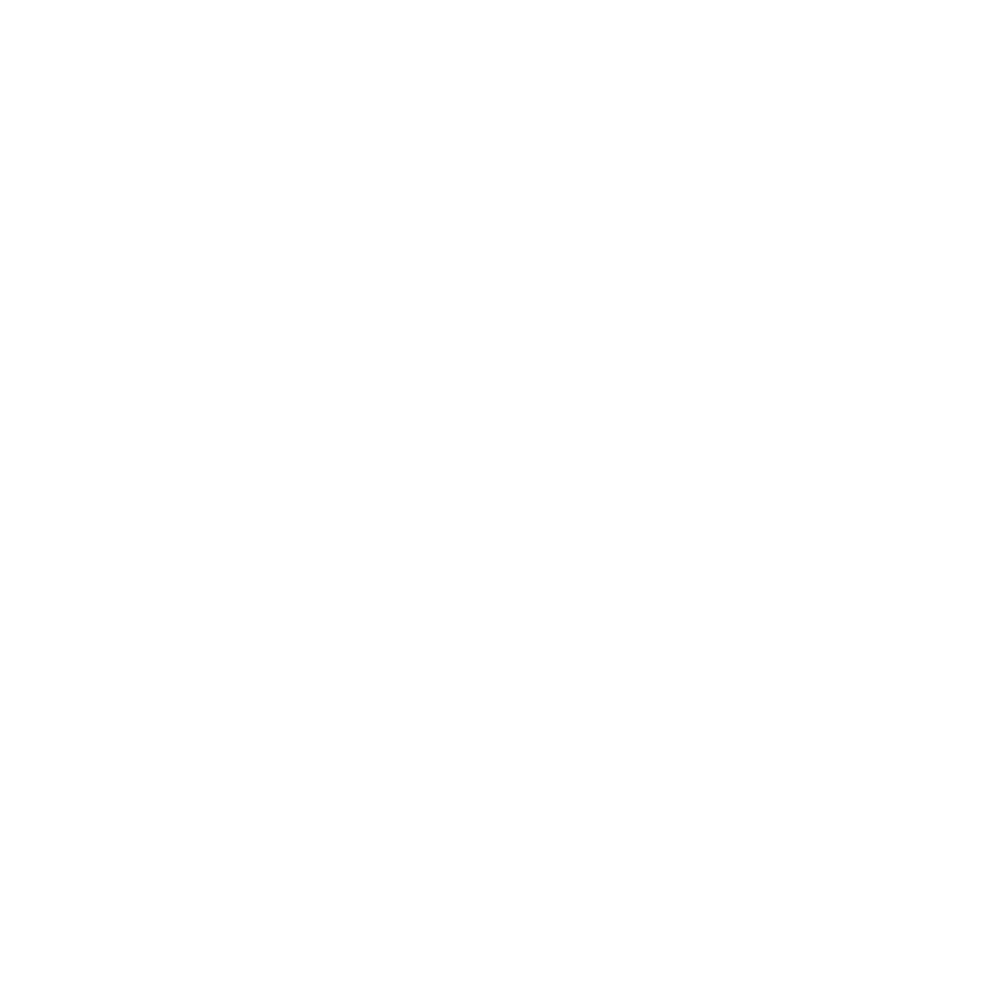
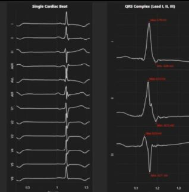
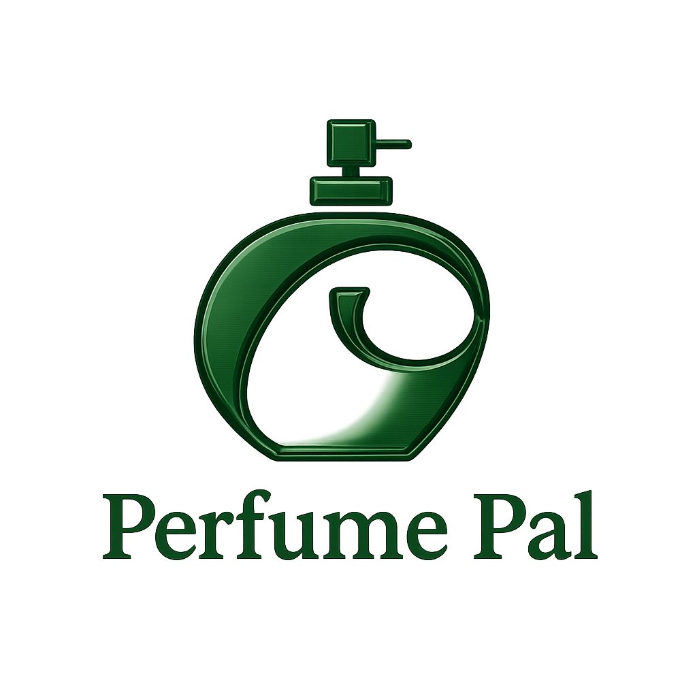
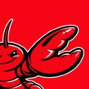
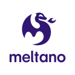
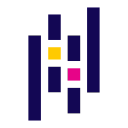
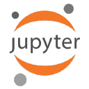

# Rami Abdelrazzaq

**Computer Science graduate · CompTIA A+ certified · Open-source contributor**

Building web applications, data tools, and AI workflows — with a focus on useful interfaces, debugging, and reliability.

[Portfolio](#selected-projects) · [Animal Battle Stats](https://animalbattlestats.com) · [LinkedIn](https://www.linkedin.com/in/rami-abdelrazzaq)

**B.S. Computer Science, Cum Laude — University of Houston, May 2025**

---

## Spotlight — Animal Battle Stats

**Creator and developer** · [Live site](https://animalbattlestats.com) · [Source](https://github.com/RamiNoodle733/animal-battle-stats) · [Project story](https://devpost.com/software/animal-battle-stats)

An interactive animal powerscaling database with **344 animals**, searchable rankings, detailed profiles, head-to-head comparisons, tier lists, tournament brackets, and community features. The interface brings wildlife data into the visual language of a fighting game.

My work includes the interface, data presentation, responsive design, comparison features, release tooling, and browser verification. The stack combines JavaScript, HTML/CSS, Astro-generated pages, Node.js tooling, Vercel serverless endpoints, and MongoDB/Mongoose.

<table>
<tr>
<td width="50%">

<b>Animal database</b> — searchable rankings and comparison controls.
</td>
<td width="50%">

<b>Animal profiles</b> — visual ratings, measurements, abilities, and sources.
</td>
</tr>
</table>

Real screenshots captured from the live website on October 8, 2026. The animal count is a dated snapshot. Ratings and simulated matchups are game-style interpretations of animal traits.

## Selected projects

<table>
<tr>
<td width="68%" valign="top">
<h3> &nbsp; Cardio Vision</h3>

<b>Boston Scientific-sponsored UH capstone</b> Six-person team · January–May 2025

ECG uploads, waveform plots, and electrical-axis visualization. I contributed database operations, bulk uploads, schema handling, graphing, responsive UI, troubleshooting, automated tests, and sponsor communication.

<b>Python · Flask · SQLAlchemy · MySQL · JavaScript · Matplotlib · Plotly · pytest · Vitest</b>

<a href="https://www.youtube.com/watch?v=EwiMXSH537k">Recorded presentation</a> · <a href="https://devpost.com/software/cardio-vision-15zp0l">Project details</a>
 Completed collaborative academic prototype.
</td>
<td width="32%" align="center" valign="middle">

 Original capstone waveform visualization
</td>
</tr>
<tr>
<td width="68%" valign="top">
<h3>Cougar Degree</h3>

<b>CodeRED Astra winner</b> [MLH] Best Use of DigitalOcean Gradient AI

AI-assisted degree planning built with Mahmoud Badi and Michael Monroe. I was a member of the three-person hackathon team, with implementation credit shared across the team. The winning version uses DigitalOcean Gradient AI; the original Gemini implementation is a separate version.

<b>JavaScript · HTML/CSS · Node.js · Express · DigitalOcean Gradient AI</b>

<a href="https://github.com/mvmonr0e/cougardegree/tree/hackathon-winning-version">Winning-version source</a> · <a href="https://devpost.com/software/cougar-degree">Award and project</a>
</td>
<td width="32%" align="center" valign="middle">

</td>
</tr>
<tr>
<td width="68%" valign="top">
<h3>Perfume Pal</h3>

<b>Cloud Run Hackathon prototype</b>

A fragrance-design workflow that turns scent preferences into recipe concepts. I created the concept, interface, agent prompts, and backend integration, drawing on my perfume-brand experience. A Scent Planner and Formula Architect divide preference interpretation from recipe generation.

<b>Python · FastAPI · Google ADK · Gemini · Docker · Google Cloud Run</b>

<a href="https://github.com/RamiNoodle733/Perfume-Pal">Source and setup</a> · <a href="https://www.youtube.com/watch?v=oRqwuaTzXdw">Recorded demo</a>
 The hosted demo needs repair; the video and source document the prototype.
</td>
<td width="32%" align="center" valign="middle">

</td>
</tr>
</table>

## Open-source contributions

**16 merged pull requests across 10 upstream repositories**, verified October 7, 2026. I contribute focused fixes, features, regression coverage, and documentation to existing projects.

| Project | Accepted contribution | Upstream evidence |
| --- | --- | --- |
| &nbsp; **[OpenClaw](https://github.com/openclaw/openclaw)** | Preserve case-distinct peer IDs during session cleanup; improve failed-update recovery; clarify context-overflow recovery | [#122006](https://github.com/openclaw/openclaw/pull/122006) · [#18131](https://github.com/openclaw/openclaw/pull/18131) · [#12973](https://github.com/openclaw/openclaw/pull/12973) |
| &nbsp; **[sqlite-utils](https://github.com/simonw/sqlite-utils)** | Empty/whitespace-only input handling, header-only CSV imports, and test-mode plugin isolation | [#837](https://github.com/simonw/sqlite-utils/pull/837) · [#707](https://github.com/simonw/sqlite-utils/pull/707) · [#719](https://github.com/simonw/sqlite-utils/pull/719) |
| &nbsp; **[Datasette](https://github.com/simonw/datasette)** | Numeric filter parameter coercion | [#2876](https://github.com/simonw/datasette/pull/2876) |
| &nbsp; **[Altair](https://github.com/vega/altair)** | Readable Unicode JSON export with an explicit ensure_ascii option, tests, and documentation | [#3952](https://github.com/vega/altair/pull/3952) |
| &nbsp; **[Meltano](https://github.com/meltano/meltano)** | Drop unset .env values and correct documentation | [#9825](https://github.com/meltano/meltano/pull/9825) · [#9833](https://github.com/meltano/meltano/pull/9833) · [#9827](https://github.com/meltano/meltano/pull/9827) |
| &nbsp; **[pandas](https://github.com/pandas-dev/pandas)** | Remove an unused shared aggregate documentation template | [#64052](https://github.com/pandas-dev/pandas/pull/64052) |
| &nbsp; **[JupyterLab](https://github.com/jupyterlab/jupyterlab)** | Naming consistency in documentation | [#18450](https://github.com/jupyterlab/jupyterlab/pull/18450) |
| &nbsp; **[Jupyter Notebook](https://github.com/jupyter/notebook)** | Repair troubleshooting and migration documentation links | [#7824](https://github.com/jupyter/notebook/pull/7824) |
| &nbsp; **[pyFoF](https://github.com/TrystanScottLambert/pyFoF)** | Astronomical input validation, integration, and tests | [#80](https://github.com/TrystanScottLambert/pyFoF/pull/80) |
| &nbsp; **[Kana Dojo](https://github.com/lingdojo/kana-dojo)** | Educational content contribution | [#3236](https://github.com/lingdojo/kana-dojo/pull/3236) |

[Browse my upstream pull requests →](https://github.com/pulls?q=is%3Apr+author%3ARamiNoodle733+is%3Amerged)

Upstream maintainers and collaborators retain credit for their projects. This index separates engineering changes from smaller documentation/content contributions. My development workflow includes AI assistance; the linked review and merge records show what was accepted.

## Tools I work with

- **Languages:** Python · JavaScript · TypeScript · SQL · HTML/CSS
- **Web and data:** Node.js · Express · React · Next.js · Flask · FastAPI · MongoDB · PostgreSQL · MySQL
- **Delivery and verification:** Git · GitHub · Docker · Linux · Vercel · Google Cloud Run · pytest · Vitest · Playwright
- **IT support training:** Windows · Ubuntu · PC hardware · Networking · Active Directory labs · Microsoft 365 · ServiceNow

## Background

- **CompTIA A+ ce** — earned June 2026.
- **Per Scholas IT Support Training** — completed June 2026; systems, hardware, networking, support workflows, and labs.
- **B.S. Computer Science, Cum Laude** — University of Houston, May 2025. Dean's List: Spring 2024, Fall 2024, Spring 2025.
- **AI Evaluation Specialist, Outlier AI** — November 2024–March 2026. Reviewed technical AI outputs and documented defects and corrections across Python and JavaScript tasks.
- **Coding Instructor, Coder Kids** — August 2024–January 2025. Taught Scratch/Python fundamentals and helped students debug setup and programming issues.

## GitHub activity

Generated daily from GitHub's contribution calendar and stored in this repository. The image shows its date range; GitHub's live contribution graph below remains the current account view.

[Refresh workflow](https://github.com/RamiNoodle733/RamiNoodle733/actions/workflows/profile-activity.yml) · [How the graph is generated](./scripts/update_activity_graph.py)
